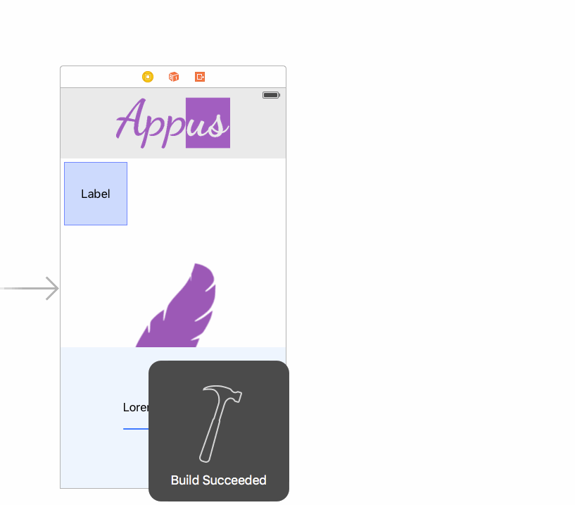
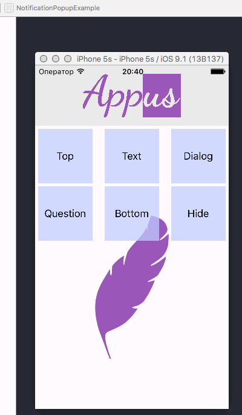
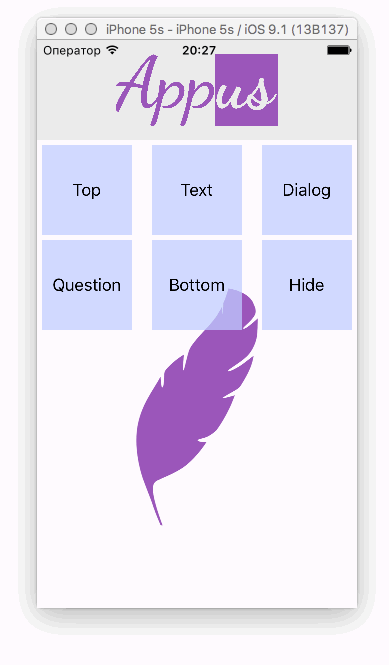

Notification-AlertView
=====================

Made by [](http://appus.pro)

'NotificationAlertView' allow you to show any view as popup notification with cube transform. Developed for easy extension and flexible integration.:point_up:

* [Setup](#setup)
* [Demo usage](#demo-usage)
* [Popup with custom view](#popup-with-custom-view)
* [Question popup](#question-popup)
* [Dialog popup](#dialog-popup)
* [Text popup](#text-popup)
* [Info](#info)

#Setup
```Ruby
pod 'NotificationAlertView'
```

# Demo usage

##Popup with custom view

As a popup may be used any view for example view configured from storyboard
```
let popup = NotificationAlertView.popupWithView(self.samplePopupView)

popup.show()
```
change height or popup position
```
let popup = NotificationAlertView.popupWithView(self.samplePopupView)

popup.position = NotificationAlertViewPosition.Bottom

popup.height = 150

popup.show()
```



##Question popup 

Popup with text and Yes/No options. Use customCompletionHandler to get presed option index (Yes:0 No:1)
```
let question = "Lorem ipsum dolor sit amet?"

let popup = NotificationAlertView.popupWithQuestion(question)

popup.customCompletionHandler = {

    (index: Int) -> Void in

    NotificationAlertView.hideAnimated(true)

    print("Taped button at index: \(index)")

}

popup.show()
```


##Dialog popup 

Popup with text and warious number of options. Use customCompletionHandler to get presed option index
```
let question = "Lorem ipsum dolor sit amet?"

let buttonTitles = ["Yes", "No", "Oh No!"]

let popup = NotificationAlertView.popupDialogWithText(question, options: buttonTitles)

popup.customCompletionHandler = {

    (index: Int) -> Void in

    NotificationAlertView.hideAnimated(true)

    let alert = UIAlertController(title: "Taped button", message: "at index: \(index)", preferredStyle: .Alert)

    alert.addAction(UIAlertAction(title: "Ok",
    style: UIAlertActionStyle.Default,
    handler: { (action) -> Void in

        alert.dismissViewControllerAnimated(true, completion: nil)

    }))

    self.presentViewController(alert, animated: true, completion: nil)   

}

popup.animationDuration = 1

popup.show()
```



##Text popup

Simple popup with text. Use hideAfterDelay property or outer action to hide


```
let popup = NotificationAlertView.popupWithText("Lorem ipsum dolor sit amet, consectetur adipiscing elit, sed do eiusmod tempor.")

popup.hideAfterDelay = 3

popup.animationDuration = 1

popup.show()
```


Developed By
------------

* Alexey Kubas, Andrey Pervushin, Appus Studio

License
--------

    Copyright 2015 Appus Studio.

    Licensed under the Apache License, Version 2.0 (the "License");
    you may not use this file except in compliance with the License.
    You may obtain a copy of the License at

       http://www.apache.org/licenses/LICENSE-2.0

    Unless required by applicable law or agreed to in writing, software
    distributed under the License is distributed on an "AS IS" BASIS,
    WITHOUT WARRANTIES OR CONDITIONS OF ANY KIND, either express or implied.
    See the License for the specific language governing permissions and
    limitations under the License.
